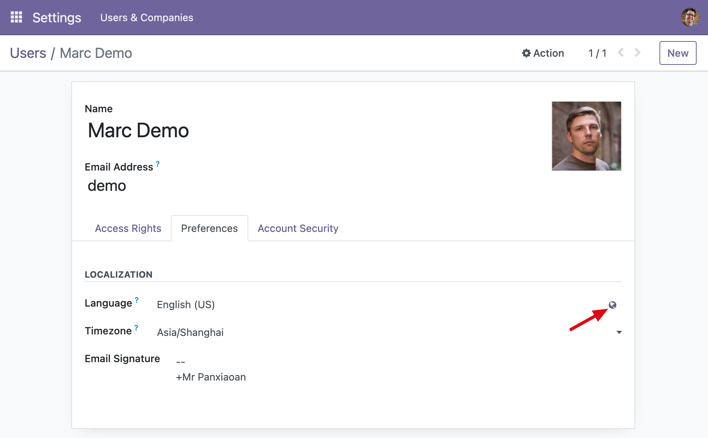
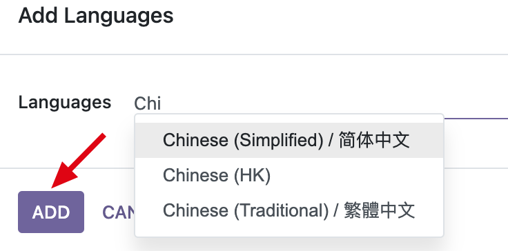

# Odoo ERP

## 登录

- URL: http://localhost:8068
- Username: admin
- Password: admin

## 设置语言和时区

- 设置中文语言和上海时区

- 加载中文语言包

## 官方 Docker 部署文档
- https://github.com/docker-library/docs/tree/master/odoo
- https://github.com/odoo/docker/blob/5b67879040592cb5d37969d0309f49355ece7d05/README.md

## Odoo ERP 用户手册
https://www.odoo.com/documentation/16.0/zh_CN/

